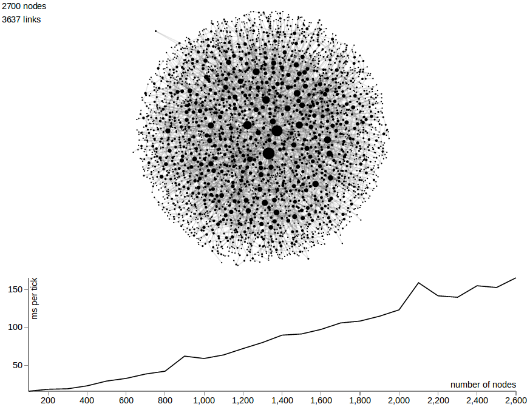

A program that profiles the performance of [D3's force directed graph layout](https://github.com/mbostock/d3/wiki/Force-Layout) by incrementally generating a scale free network based on the [Barabási–Albert model](http://en.wikipedia.org/wiki/Barab%C3%A1si%E2%80%93Albert_model).

</img>
[run it!](http://curran.github.io/HTML5Examples/d3/scaleTest/)

The result of this experiment is that performance of the layout and visualization (combined) slows down linearly with respect to the number of nodes. Around 10,000 nodes, the visualization takes about 700 milliseconds to compute layout and render. This means that interaction with the layout by pinning specific nodes is out of the question for networks with more than 10,000 nodes.

Curran Kelleher
2/27/2014
